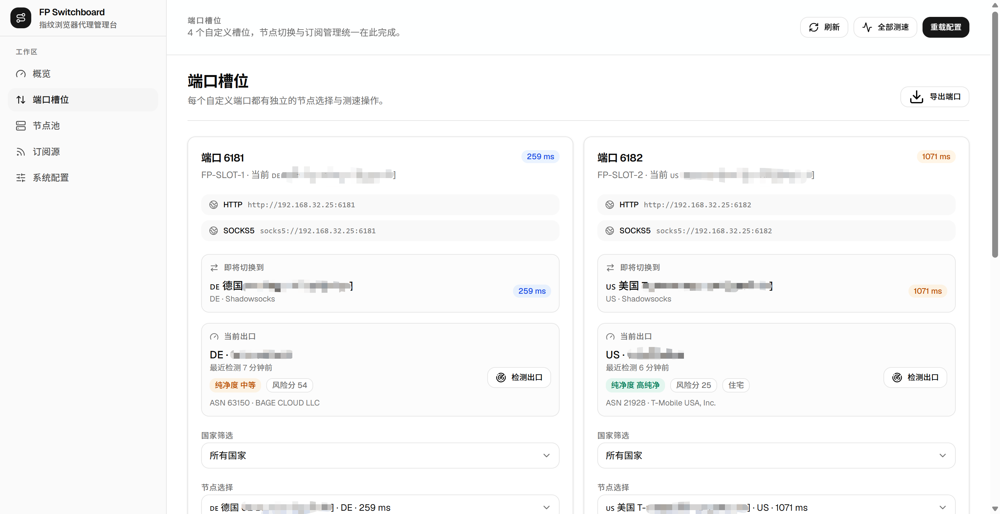
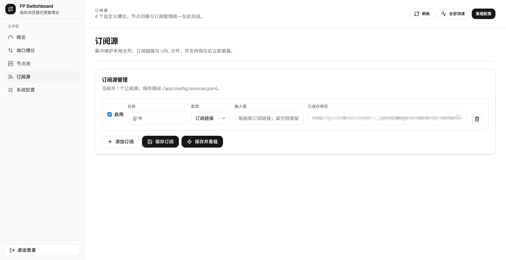
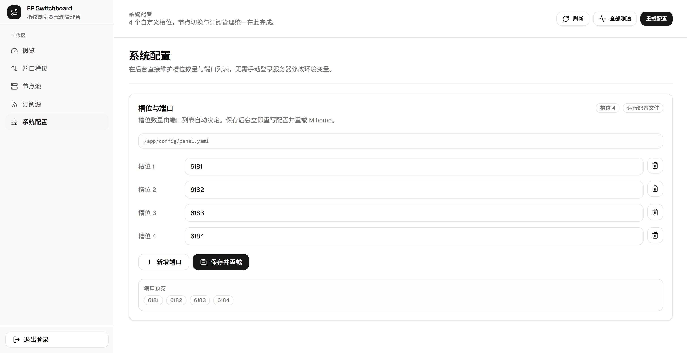

# Fingerprint Proxy Switchboard

Fingerprint Proxy Switchboard is a lightweight control plane for fixed proxy slots backed by Mihomo. Each slot is exposed as a stable port and can be switched to a different node independently, making it useful for fingerprint browsers, multi-profile browsers, and browser automation setups that depend on deterministic proxy endpoints.

## Features

- Custom slot count and custom slot ports through `SLOT_PORTS` or the admin UI
- HTTP and SOCKS5 on the same port via Mihomo `mixed` listeners
- Dedicated Mihomo instance, isolated from an existing system-level deployment
- Web dashboard for slot switching, source management, delay testing, and config reload
- Multiple source input methods: local file, remote URL, or URL file
- React-based admin UI with a modern dashboard layout

## Screenshots

### Overview


### Slots



### Sources



### Settings



## Use Cases

- Fingerprint browsers that need stable per-profile proxy ports
- Browser automation farms that should not rewrite proxy endpoints after every node switch
- Small self-hosted teams that want a web UI instead of editing Mihomo configs by hand

## Stack

### Backend

- Python 3.9
- FastAPI
- httpx
- PyYAML

### Frontend

- React 19
- TypeScript
- Vite 8
- Tailwind CSS v4
- TanStack Query
- Lucide React

### Runtime

- Docker Compose
- Dedicated Mihomo container
- Host networking for controller and slot exposure

## Repository Layout

```text
.
├── app/
│   ├── main.py
│   ├── config_builder.py
│   ├── mihomo_client.py
│   ├── render_config_cli.py
│   └── settings.py
├── config/
│   ├── source.example.yaml
│   ├── sources.example.yaml
│   ├── subscription-cache/
│   └── subscriptions/
├── web-ui/
├── Dockerfile
├── docker-compose.yml
└── .env.example
```

## Requirements

- Docker Engine
- Docker Compose
- A Linux host that can expose fixed proxy ports
- Network access to your upstream subscription sources

## Quick Start

### 1. Prepare environment variables

```bash
cp .env.example .env
```

At minimum, review and update:

- `PANEL_TOKEN`
- `PROXY_AUTH`
- `PUBLIC_HOST`
- `MIHOMO_SECRET`

### 2. Prepare source files

Single-source mode:

```bash
cp config/source.example.yaml config/source.yaml
```

Multi-source mode:

```bash
cp config/sources.example.yaml config/sources.yaml
```

Choose either single-source mode or multi-source mode. You do not need both at the same time.

For private subscription URLs, prefer storing the raw URL in `config/subscriptions/*.url` and referencing that file through `url_file`.

### 3. Build and start

```bash
docker compose up -d --build
```

### 4. Open the dashboard

```text
http://<your-host>:6310
```

Default proxy endpoint example:

```text
HTTP   http://<your-host>:6181
SOCKS5 socks5://<your-host>:6181
```

Additional slots follow the same pattern for the rest of the configured ports.

For example:

```env
SLOT_PORTS=6181,6182,7001,7002,7003
```

The example above exposes 5 slots. The number of active proxy slots is always equal to the number of ports listed in `SLOT_PORTS`.
After deployment, you can also adjust slot count and port list from the `System Settings` page, which persists runtime values into `config/panel.yaml`.

## Environment Variables

| Variable | Default | Description |
| --- | --- | --- |
| `PANEL_HOST` | `0.0.0.0` | Dashboard bind address |
| `PANEL_PORT` | `6310` | Dashboard port |
| `PANEL_TOKEN` | `change-me` | Dashboard login token |
| `PUBLIC_HOST` | user-defined | Public host or IP shown in exported endpoints |
| `PROXY_AUTH` | empty | Proxy auth in `username:password` format |
| `MIHOMO_API` | `http://127.0.0.1:6311` | Mihomo API base URL |
| `MIHOMO_SECRET` | empty | Mihomo external-controller secret |
| `MIHOMO_CONTROLLER` | `127.0.0.1:6311` | Mihomo controller address |
| `MIHOMO_CONFIG_PATH` | `/root/.config/mihomo/config.yaml` | Mihomo config output path |
| `SLOT_PORTS` | `6181,6182,6183,6184,6185,6186` | Slot port list; the number of ports equals the number of slots |
| `SOURCE_PATH` | `/app/config/source.yaml` | Single-source config path |
| `SOURCES_PATH` | `/app/config/sources.yaml` | Multi-source manifest path |
| `OUTPUT_PATH` | `/app/config/config.yaml` | Generated Mihomo config output |
| `DELAY_TEST_URL` | `https://www.gstatic.com/generate_204` | Delay test probe URL |
| `SUBSCRIPTION_URL_FILE` | empty | Legacy single URL file option |

## Source Configuration

### Single-source example

```yaml
proxies:
  - name: Example-SS
    type: ss
    server: example.invalid
    port: 443
    cipher: aes-128-gcm
    password: change-me
```

### Multi-source example

```yaml
sources:
  - name: local-provider
    path: /app/config/source.yaml
  - name: remote-provider
    url: https://example.invalid/subscription.yaml
  - name: remote-provider-secret
    url_file: /app/config/subscriptions/provider.url
```

## Local Development

### Backend

```bash
python3 -m venv .venv
source .venv/bin/activate
pip install -r requirements.txt
uvicorn app.main:app --host 0.0.0.0 --port 6310
```

### Frontend

```bash
cd web-ui
cp .env.example .env
npm install
npm run dev
```

If the frontend is running on a different machine than the API, set:

```bash
VITE_API_PROXY_TARGET=http://<your-host>:6310
```

## Security Notes

- Do not commit real `.env` files
- Do not commit live subscription URLs, `.url` files, generated `config.yaml`, or runtime cache files
- `config/subscription-cache/` is runtime data and should remain untracked
- The repository currently ships with the MIT license. Change it if you need a different distribution model.

## Suggested Pre-Publication Checklist

1. Reconfirm that no live secrets remain under `.env` or `config/`
2. Add screenshots and repository topics
3. Refine `CONTRIBUTING.md` further if you want a stricter contribution workflow

## Release Notes

- You can reuse [docs/release-notes.md](./docs/release-notes.md) as the GitHub Release draft template
