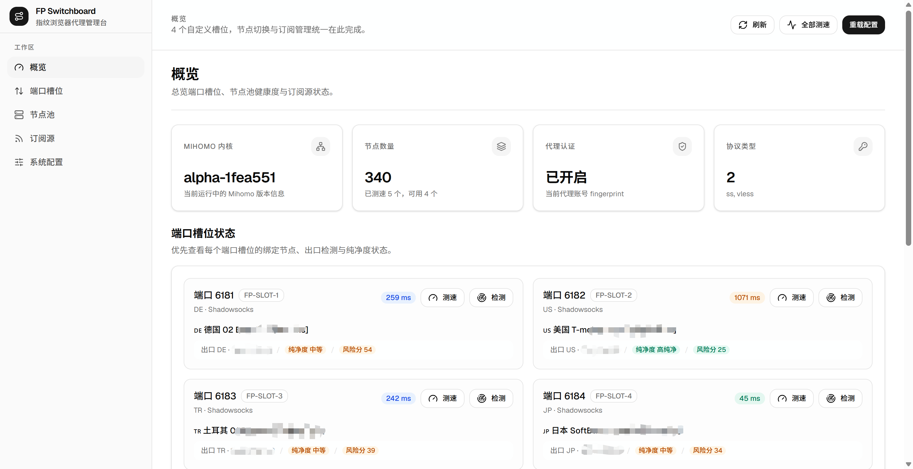

# Fingerprint Proxy Switchboard

Lightweight Mihomo-powered switchboard for fingerprint browser proxy slots.  
用于管理指纹浏览器固定代理端口的轻量面板，基于 Mihomo 实现节点切换、测速与订阅管理。

[中文文档](./README.zh-CN.md) | [English Documentation](./README.en.md)

## Overview | 项目概览

- Custom slot count and custom slot ports through `SLOT_PORTS` or the web admin settings page
- HTTP and SOCKS5 exposed on the same slot port through Mihomo `mixed` mode
- FastAPI backend for slot switching, delay testing, source management, and config reload
- React dashboard UI inspired by modern shadcn-style admin panels
- Multi-source subscription manifest support with local path, direct URL, or URL file input

## Screenshot | 界面预览



## Quick Start | 快速开始

```bash
cp .env.example .env
# single-source mode:
# cp config/source.example.yaml config/source.yaml
#
# multi-source mode:
# cp config/sources.example.yaml config/sources.yaml
docker compose up -d --build
```

Open `http://<your-host>:6310`.

Example custom slot port configuration:

```env
SLOT_PORTS=6181,6182,7001,7002,7003
```

The number of exposed proxy slots is determined by the number of ports in `SLOT_PORTS`.
After the first deployment, you can also update the slot count and slot port list directly in the dashboard under `System Settings`, which writes runtime config to `config/panel.yaml`.

## Repository Layout | 仓库结构

```text
.
├── app/          # FastAPI API, config generation, Mihomo client
├── config/       # Example configs only; runtime data must stay untracked
├── web-ui/       # React 19 + TypeScript + Tailwind v4 dashboard
├── Dockerfile    # Multi-stage image build
└── docker-compose.yml
```

## Docs | 文档

- [README.zh-CN.md](./README.zh-CN.md)
- [README.en.md](./README.en.md)
- [config/README.md](./config/README.md)
- [web-ui/README.md](./web-ui/README.md)
- [docs/release-notes.md](./docs/release-notes.md)

## Publishing Notes | 发布说明

- Runtime configs, generated Mihomo files, subscription cache, and secrets are intentionally excluded from version control.
- The repository now includes an MIT license. Adjust it if your distribution goals differ.
